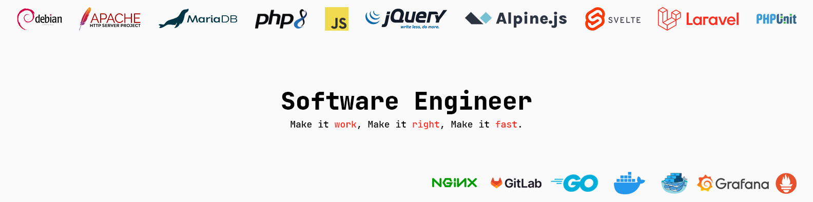

# Florian Pisani
https://www.linkedin.com/in/f-pisani/

## Experience
### Full Stack Developer
**Digifactory - Logiciel SaaS** • *2018-12 / 2022-01*
- Conception et implémentation de nouvelles fonctionnalités au sein du logiciel SaaS (CRM, ERP, CMS, Marketing, Production, Event)
- Correction de bugs et évolution de l'existant (PHP 5 legacy, monté en version sur PHP 7.4 vanilla, framework interne)
- Conception et implémentation d'un nouveau workflow CI/CD (multi-instance) basé sur Git
- Mise en place de PHPUnit et de tests unitaires/intégration
- Sensibilisation de l'équipe de développement aux principes SOLID, DRY, KISS, YAGNI et aux PSRs

- Gestion de projet (prise de briefs, rédaction cdc, envoi de devis, suivi des temps passés, up-selling, ...)
- Conception, réalisation et maintenance de projets clients (e-commerce, sites évènementiels, développements sur mesure (écrans de stats, exports dédiés, interfaçages, ...))

- Montée en compétences des acteurs internes (développeurs, chef de projet, commerciaux) autour du logiciel
- Suivi des demandes HelpDesk (formation, accompagnement, support, résolution de problèmes)
- Sessions de formation clients

### Crypto Day Trader
**Auto-entrepreneur** • *2017-07 / 2018-12*
- Trading de crypto-monnaies
- Suivi des cours sur divers exchanges Bitmex, Poloniex, Coinbase, Binance, ...
- Suivi des évolutions autour de la technologie Blockchain

### Manager Opérationnel
**BURGER KING France** • *2016-09 / 2017-11*
- Ouverture du restaurant de Paris Bastille
- Formation des équipiers
- Gestion des plannings
- Gestion des commandes
- Briefing / Debriefing et suivi des performances des équipiers

### Assistant manager
**McDonald's France** • *2015-09 / 2016-07*
- HACCP
- Chargé de dépôts / Brinks
- Formation des équipiers
- Travail en binôme avec le manager de shift

### Equipier de polyvalent
**McDonald's France** • *2014-08 / 2015-09*

## Formation
### OpenClassrooms
**Développeur Web Junior** • *2018-07 / 2018-10*

### Université de Versailles Saint-Quentin-en-Yvelines
**Licence 1 - Informatique** • *2013-09 / 2014-07*

### Lycée Ernest Hemingway
**Baccalauréat STG spécialité "Gestion des Systèmes d'Informations"** • *2010-09 / 2013-07*  
Admis mention "Assez Bien"